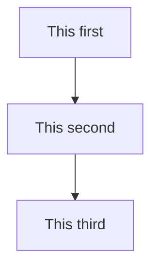

This is an example blog post that you can use as a template.

{/* truncate */}

## Blog posts can contain all kinds of stuff.

**Text:**

Lorem ipsum dolor sit amet, consectetur adipiscing elit. Aliquam euismod lectus efficitur, vehicula odio id, ullamcorper nibh. Donec pulvinar odio a quam finibus condimentum. Cras a ultricies justo. Fusce sagittis massa vel velit tempus, ut egestas mauris euismod. Donec nec rhoncus purus. Fusce tellus orci, fringilla malesuada auctor et, sollicitudin nec leo. Donec eu molestie purus, sed vestibulum elit. Aenean efficitur tellus in aliquet feugiat. In vitae sapien vel velit vehicula maximus. Maecenas quam augue, malesuada quis mollis nec, cursus non purus.

**Code:**

```c
#include <stdio.h>

int main()
{
    printf("Hello, world!\n");

    return 0;
}
```

**Admonations:**

:::danger[A title to get your attention]

Be warned!!

:::


**Mermaid Charts**

