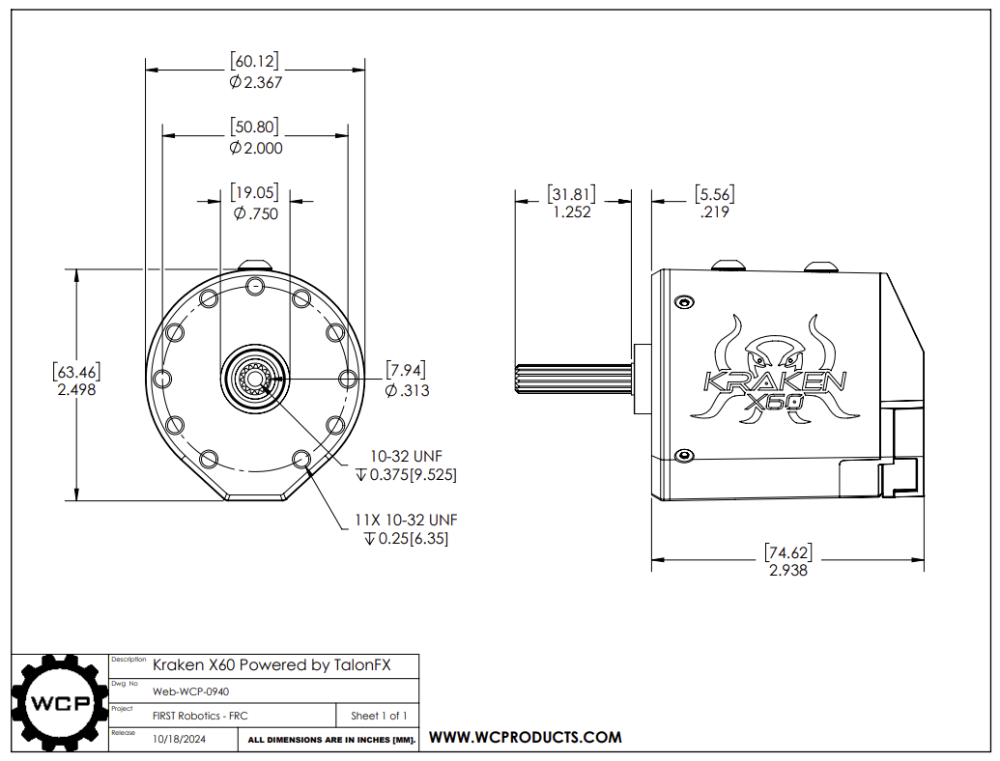
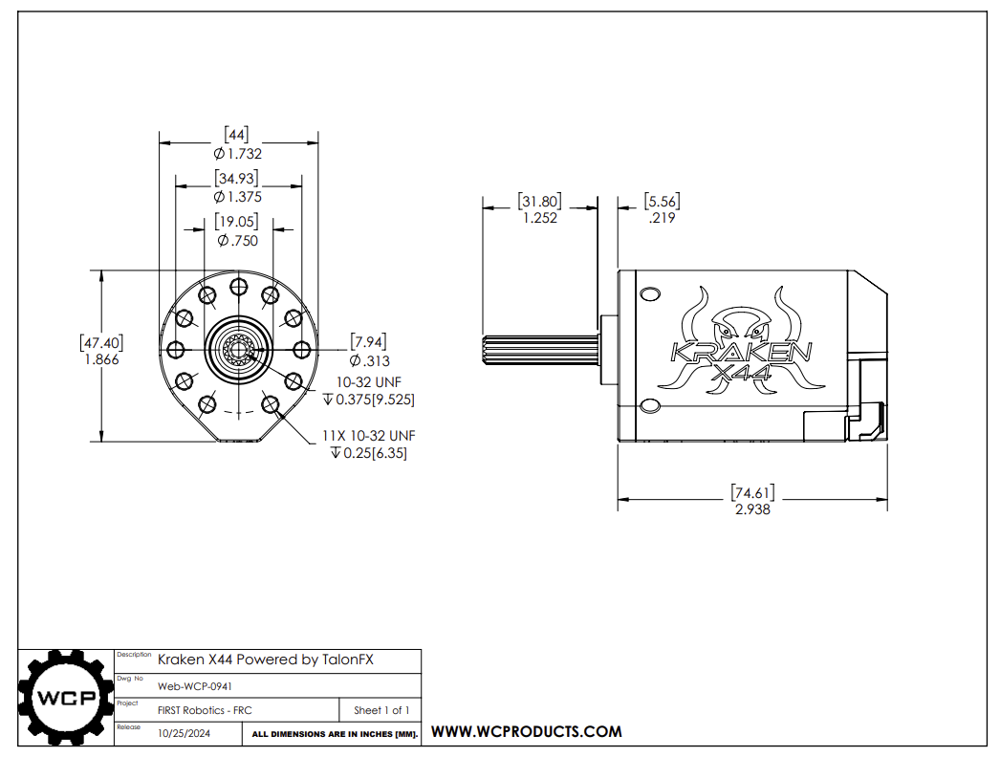
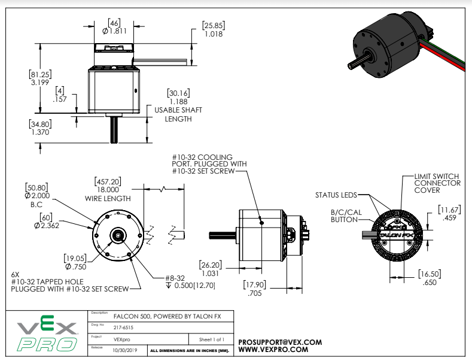

# Brushless Motor Quick Reference Guide

---

## Kraken X60

**Specifications**
- **Type:** Brushless with integrated controller
- **Free Speed:** 6,000 RPM
- **Stall Torque:** 7.09 N⋅m (62.8 in⋅lb)
- **Stall Current:** 366A
- **Weight:** 1.2 lbs

**Stocked Quantities**
Available motors: `Yes`

**Where to Buy**
[Kraken X60 - WCP](https://wcproducts.com/products/kraken)

---

## Kraken X44

**Specifications**
- **Type:** Brushless with integrated controller
- **Free Speed:** 7530 RPM
- **Stall Torque:** 4.05 N⋅m 
- **Stall Current:** 275 A
- **Weight:** 0.75 lbs

**Stocked Quantities**
Available motors: `Yes`

**Where to Buy**
[Kraken X44 - WCP](https://wcproducts.com/products/kraken)

---

## Falcon 500

**Specifications**
- **Type:** Brushless with integrated controller
- **Free Speed:** 6,380 RPM
- **Stall Torque:** 4.69 N⋅m 
- **Stall Current:** 257A
- **Weight:** 1.1 lbs

**Stocked Quantities**
Available motors: `Yes`

**Where to Buy**
[Falcon 500 - Cross the Road Electronics](https://store.ctr-electronics.com/falcon-500-powered-by-talon-fx/)
