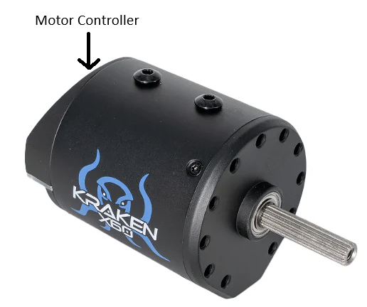
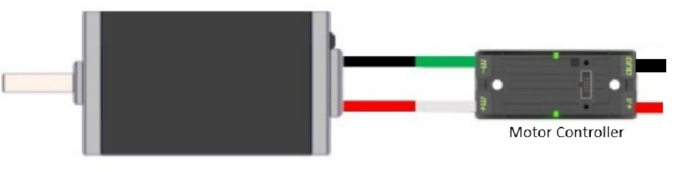

# Motor Overview

## Overview

**Motors** are devices that convert electrical energy into mechanical motion. In FRC robotics, motors are the powerhouse that make everything move - from driving the robot around the field to operating mechanisms like arms, shooters, and intakes.

---

## Types of Electric Motors

### Brushed Motors (The Older Type)

**Think of it like:**
- Something inside physically "switches" the electricity as it spins. Like little contacts rubbing.

**Good parts:**
- Usually cheaper to make and buy. Simple.

**Not-so-good parts:**
- Those rubbing contacts wear out over time, like pencil erasers. This means they don't last as long, create some friction (which wastes a little power and makes heat), and can be a bit noisy or sparky.

**FRC legal motors:**
- CIM, Mini CIM, Bag, 775 pro, Venom

---

### Brushless Motors (The Newer Type)

**Think of it like:**
- The switching of electricity is done electronically, with smart parts, instead of physically rubbing.

**Good parts:**
- Last much, much longer because there's no rubbing to wear things out. More efficient (use less power to do the same work). Often more powerful and smoother.

**Not-so-good parts:**
- Cost a bit more upfront because they need those smart electronic parts.

**FRC legal motors:**
- Falcon, Kraken 60x, Kraken 44x, Neo

---

## Motor Controller

Think of a motor controller as the **brain for an electric motor**. Instead of just turning a motor on or off at full power like a simple switch, a motor controller lets you control it.

### Types of Motor Controllers

There are typically two main ways motor controllers work:

**Integrated Controllers:**
- The controller is built right into the motor
- Examples: Falcon 500, Kraken motors

**Non-Integrated (External) Controllers:**
- The controller is a separate unit connected by wires
- Examples: Talon SRX, Spark MAX, Victor SPX
