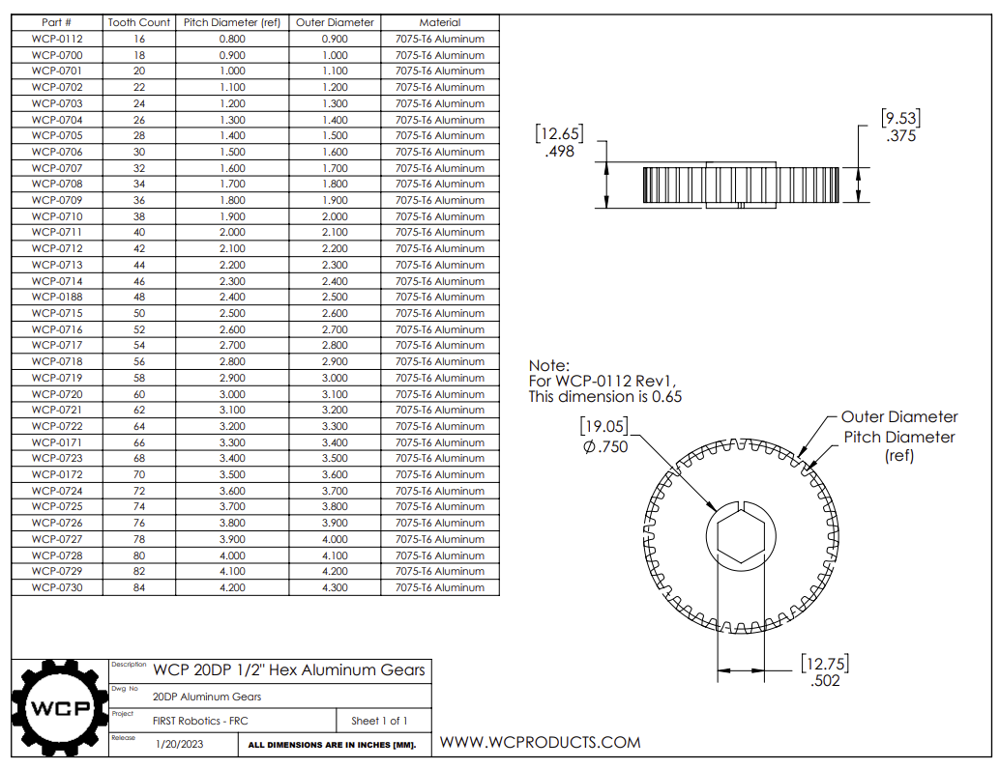
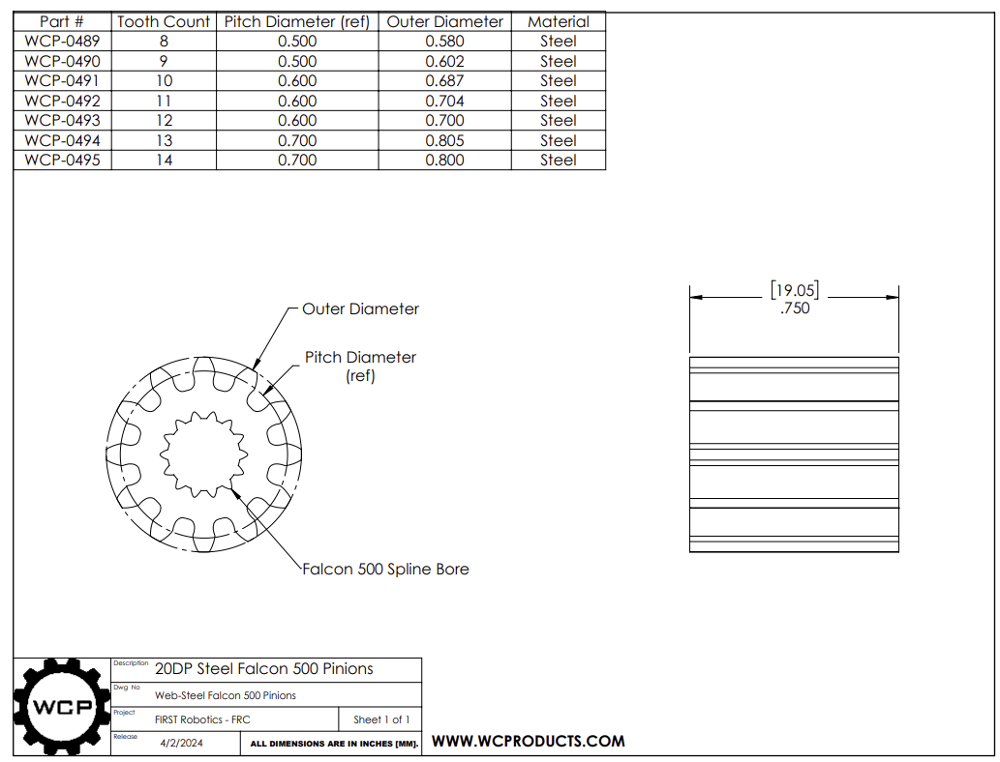
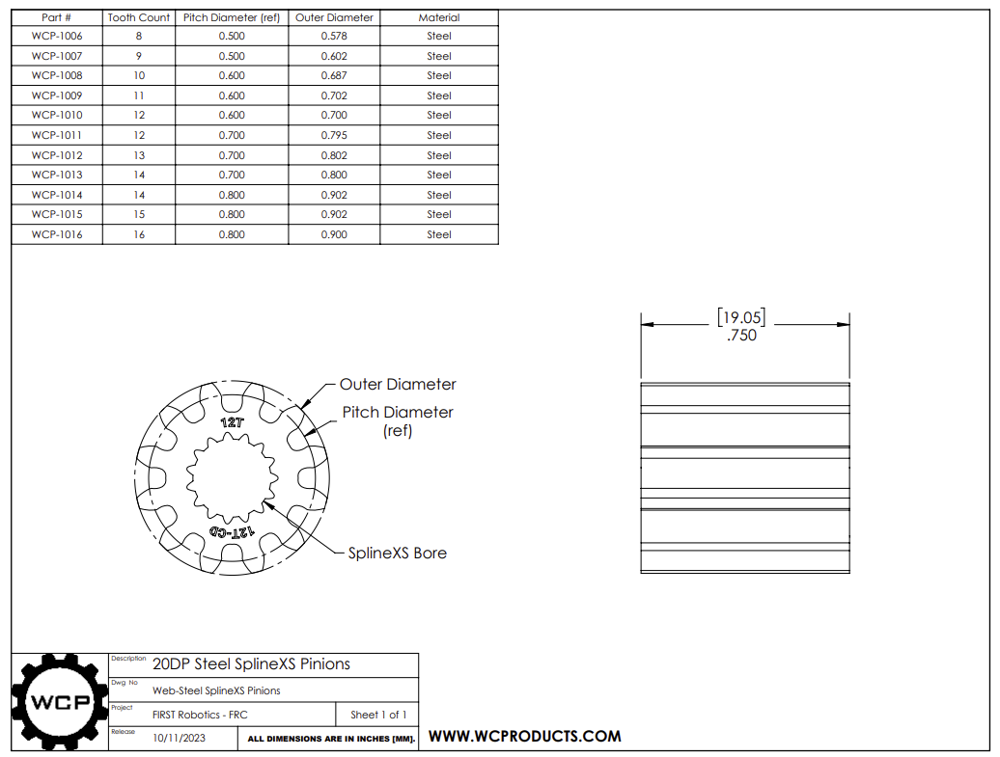

# Gear Overview

## Overview
- **What they are:**  
    - Wheels with teeth cut around their edges.
- **What they do:**   
    - The teeth of one gear fit into the teeth of another gear, so turning one gear makes the connected gear turn. They are used to transfer power and can change how fast something spins or the amount of twisting force (torque), and even change the direction.
- **Pros:**  
    - Very strong and efficient for transferring power, highly precise motion (no slipping), good for changing speed and torque in a small space.
- **Cons:**   
    -Can be loud, need to be lined up very carefully to work right, only work well when they are close together, can cost more to make.


---

## Argos Standard 
 **Gears**  
Argos almost always uses **20dp gears** with **hex shafts** or **spline shafts**.

- **20dp** refers to the specific size and spacing of the gear teeth, ensuring proper meshing.
- **Hex shafts** are the six-sided axles these gears mount onto, providing a strong, non-slip connection
- **Spline shaft** is a rod that has multiple ridges or "teeth" running along its length.

**Pinions**  
A **pinion** is just a small gear. It's often the first gear connected to a motor or spinning shaft, and it meshes with a larger gear to transfer power.


---

## How to Calculate Gear Center Distance

[Gear Center Distance Calculator](https://wcproducts.com/pages/calculator-gear)

To calculate the theoretical center distance between two meshing spur gears with the same diametral pitch (DP), you use the following equation:

``` math
Center Distance = ((N1+N2)/(2 x DP)) + Extra_Distance
```

**Where:**
- **N1** is the number of teeth on the first gear
- **N2** is the number of teeth on the second gear  
- **DP** is the diametral pitch (the number of teeth per inch of pitch diameter)
- **Extra_Distance** = account for manufacturing tolerances and ensure smooth operation (Should be 0.003 in)

**Example**

**Gear 1:** 20DP, 60 tooth  
**Gear 2:** 20DP, 20 tooth

```
Center Distance = ((60+20)/(2x20))+0.003 = 2.003 in
```


---

## Quick Reference

### 1/2" Hex Gears


**Stocked Sizes**  
Available teeth: `20` | `30` | `40` | `50` | `60`

**Where to Buy**  
[1/2 Hex Gears - West Coast Products](https://wcproducts.com/products/aluminum-hex-bore-gears)

---

### 3/8" Hex Gears


**Stocked Sizes**  
Available teeth: `N/A`

**Where to Buy**  
[3/8 Hex Gears - West Coast Products](https://wcproducts.com/products/aluminum-hex-bore-gears)

---

### Falcon Pinion


**Stocked Sizes**  
Available teeth: `12` | `14` | `16`

**Where to Buy**  
[Falcon Pinions - West Coast Products](https://wcproducts.com/products/20dp-motor-gears)

---

### Kraken Pinion


**Stocked Sizes**  
Available teeth: `12` | `14` | `16`

**Where to Buy**  
[Kraken Pinions - West Coast Products](https://wcproducts.com/products/20dp-motor-gears)