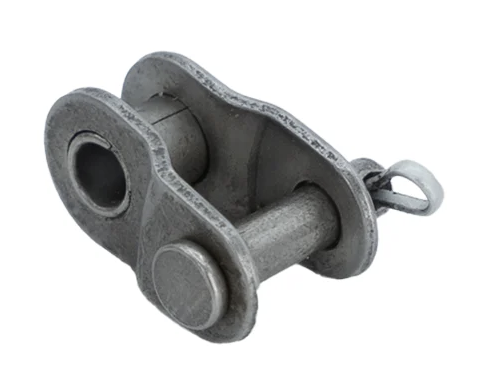
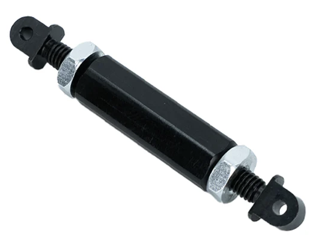
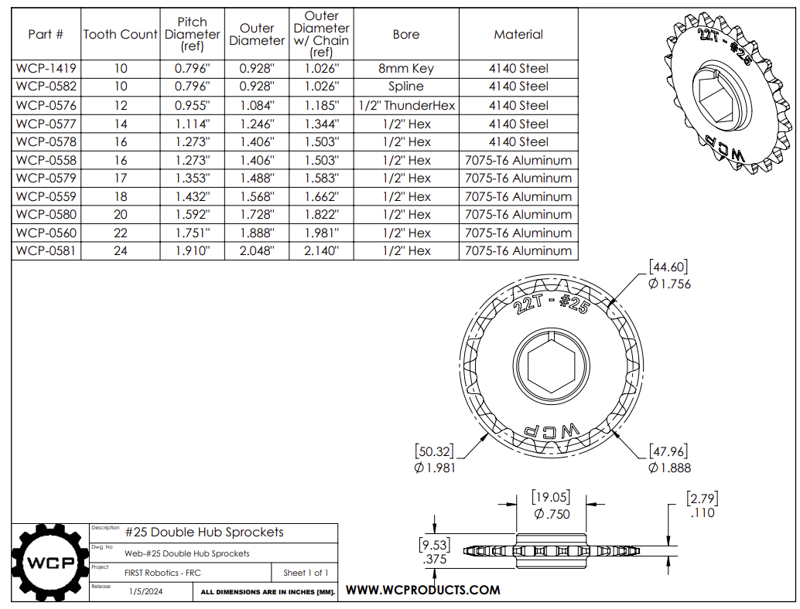

import half_link from './half_link.png'
import chain_tension from './chain_tension.png'
import ChainCalculator from '@site/src/components/ChainCalculator'

# Chain & Sprocket Overview

## Overview

- **What they are:**
    - Sprockets are toothed wheels, and a chain is made of connected metal links that fit onto those teeth.
- **What they do:**
    - When a sprocket turns, its teeth grab the chain and pull it, which makes another sprocket turn. This is a strong way to transfer power.
- **Pros:**
    - Very strong and tough for heavy loads, no slipping (motion is precise), can work over moderate distances. Can make chains almost any size.
- **Cons:**
    - Can be noisy, needs oiling and cleaning, not as smooth as belts, chains can stretch over time, heavy.

    

---

## Argos Standard 
**Chain**   
Argos uses **#25 Roller Chain**
- A common ANSI standard chain, identified by its **1/4-inch pitch**
- Suitable for light-duty applications

**Standard Sprocket**  
**Standard Sprocket Size:** 16 Teeth 1/2" hex

---

## How to Calculate Chain Center Distance

<ChainCalculator />

### External Calculator Reference
[Center Distance Calculator](https://electricscooterparts.com/chainlengthcalculator.html)

**If Sprockets are the Same Size**

- **#25 chain** - Center distance should be a multiple of **0.25 in**
- **#35 chain** - Center distance should be a multiple of **0.25 in**

## How to Tension Chain

### Adding Center Distance
**For #25 chain add 0.018 inch**
- This is a set length no matter how long the chain is
- Reference: [FIRST Design: Effective mechanical mechanisms for FIRST](https://www.youtube.com/watch?v=aBOnxpYnqJ8&list=PLb6dJRw1dZvteKHhATbf9VwuD8c9aPu1j&t=1178s) - go to 19:40 for chain info by FRCTeam1718

### Chain Turn Buckles
- If the chain does not have to go around a full loop, you can use a turn buckle
- Provides adjustable tensioning mechanism

  

### Half Links  
- Special link that is half the standard distance
- Used for fine-tuning chain length when full links don't provide the exact center distance needed

  

## How to Size Chain

[How To: Chain Breakers](https://www.youtube.com/watch?v=WXpWhqeg2bo)

---
## Quick Reference 

### #25 Roller Chain

**Stocked Sizes**
Available lengths: `Yes`

**Where to Buy**
[#25 Roller Chain - WCP](https://wcproducts.com/collections/belts-chain-gears/products/roller-chain)

---

### #25 16-Tooth Sprocket (1/2" Hex)

**Stocked Sizes**
Available quantities: `16 tooth (8)`

**Where to Buy**
[16T Sprockets - West Coast Products](https://wcproducts.com/collections/sprockets-chain/products/25-chain-sprockets)

---

### Half Links

**Stocked Sizes**
Available quantities: `Yes`

**Where to Buy**
[Half Links - WCP](https://wcproducts.com/collections/belts-chain-gears/products/roller-chain)

---

### Master Links

**Stocked Sizes**
Available quantities: `Yes`

**Where to Buy**
[Master Links - WCP](https://wcproducts.com/collections/belts-chain-gears/products/roller-chain)

---

### Chain Tensioners

**Stocked Sizes**
Available quantities: `Yes`

**Where to Buy**
[Chain Tensioners - West Coast Products](https://wcproducts.com/collections/belts-chain-gears/products/roller-chain)

---

### #35 16-Tooth Sprocket (1/2" Hex)

**Stocked Sizes**
Available quantities: `16 tooth (8)`

**Where to Buy**
[16T Sprockets - West Coast Products](https://wcproducts.com/collections/sprockets-chain/products/25-chain-sprockets)

---