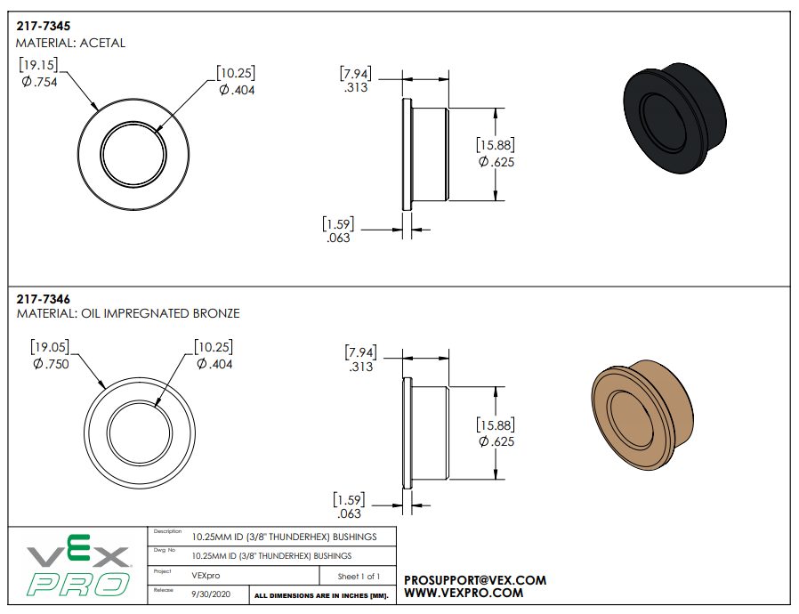

import Bearing from './Bearing.png'
import Bushing from './Bushing.png'

# Bearings and Bushings

## Bearings Overview
Think of them like tiny wheels or rollers that help things spin or move with very little effort. They use rolling to drastically cut down on rubbing.

**When to use them:** Choose bearings for things that spin *fast* or need to move *very easily and smoothly*, like in car wheels, electric motors, or fidget spinners. They are great for reducing friction at higher speeds and loads.

  

## Bushings Overview
Think of them as smooth sleeves or tubes that parts slide inside of. They use a slippery surface or a bit of grease to reduce rubbing, but it's still more of a sliding motion.

**When to use them:** Use bushings for things that move *slower* or have *heavier loads* but don't need to spin super fast. They are often simpler, cheaper, can handle harsher conditions (like dirt), and are found in things like door hinges, car suspension, or some simple pivots.

  

---

## Bearing Quick Reference 
### Hex Bearing

**Stocked Sizes**  
Available lengths: `1/2 hex`

**Where to Buy**
[Bearings - WCP](https://wcproducts.com/collections/cnc-hardware/products/ball-bearings)

---

### 3/8" Hex Bushing

**Stocked Sizes**
Available lengths: `N/A`

**Where to Buy**
[Bushings - WCP](https://wcproducts.com/collections/cnc-hardware/products/bushings)

---

### 1/2" Hex Bushing

**Stocked Sizes**
Available lengths: `1/2 hex`

**Where to Buy**
[Bushings - WCP](https://wcproducts.com/collections/cnc-hardware/products/bushings)

---

