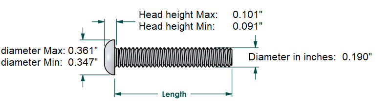
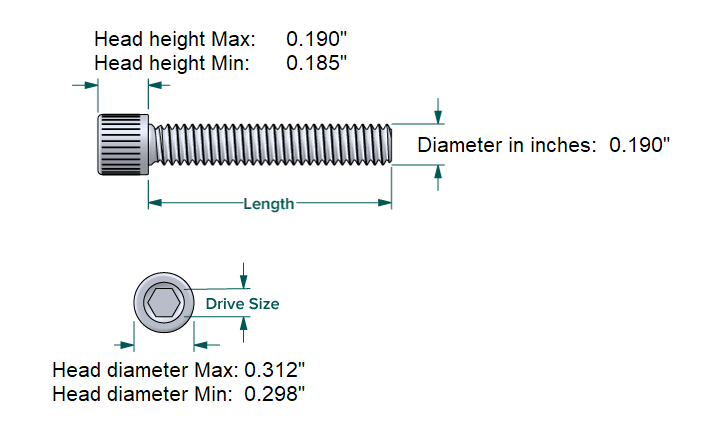
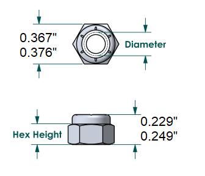
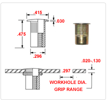

import washer from './10-32_washer.png'

# 10-32 Quick Reference Guide 

## Size Chart
  

---

## Button Head Bolt

**Stocked Sizes**  
Available lengths: `1/4"` | `1/2"` | `5/8"` | `1"` | `1.5"` | `2"` | `2.5"` | `3"`

**Where to Buy**  
[Socket Button Head Screws - Bolt Depot](https://www.boltdepot.com/Socket_button_head_Alloy_steel_black_oxide_finish_10-32.aspx)

---

## Cap Head Bolt
  

**Stocked Sizes**  
Available lengths: `N/A`

**Where to Buy**  
[Socket Cap Head Screws - Bolt Depot](https://www.boltdepot.com/Socket_cap_Alloy_steel_black_oxide_finish_10-32.aspx)

---

## Chamfer Head Bolt
  

**Stocked Sizes**  
Available lengths:  `3/8`

**Where to Buy**  
[Socket Flat Head Screws - Bolt Depot](https://www.boltdepot.com/Socket_flat_head_Alloy_steel_black_oxide_finish_10-32.aspx)

---

## Shoulder Bolt

**Stocked Sizes**  
Available lengths: `3/4` | `1.25`

**Where to Buy**  
[Shoulder Bolts - Bolt Depot](https://boltdepot.com/Shoulder_bolts_Alloy_steel_black_oxide_finish_1_4_shoulder_(10-32_thread))

---

## Lock Nut
  

**Stocked Sizes**  
Available types: `Standard` | `Nylock` 

**Where to Buy**  
[Nuts - Bolt Depot](https://www.boltdepot.com/Product-Details.aspx?product=2553)

---

## Rivenut
  

**Stocked Sizes**    
Available lengths: `Yes`

**Where to Buy**  
[Rivnuts 10-32 Hanson Rivenut](http://www.erivet.com/product_detail.cfm?ID=ERIVET_5130436_35803349&itemtype=&brand_cd=&srchtxt=SKL10%2D32%2D225&view=list&sortBy=itemNbr_asc&itemNbr=R%2DSKL1032225)

---

## Washer
  

**Stocked Sizes**    
Available types: `Standard` | `Fender`

**Where to Buy**  
[Washers - Bolt Depot](https://boltdepot.com/Product-Details?product=22029)
[Fender Washer - Bolt Depot](https://boltdepot.com/Product-Details?product=2929)

---

