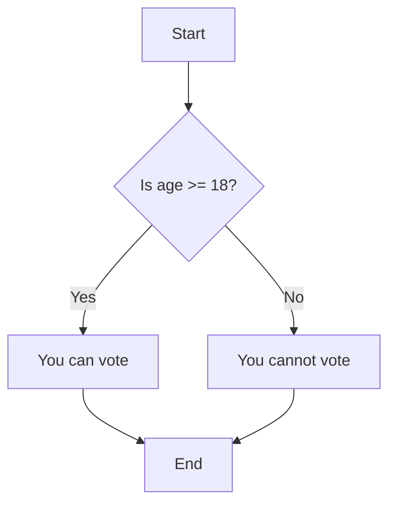

# C++ Quick Reference

## File Types: .h and .cpp Files

In C++, code is typically organized into two types of files:

### Header Files (.h)
Header files contain **declarations** - they tell the compiler what functions, classes, and variables exist, but not how they work.

Think of a header file like a **table of contents** or **menu** at a restaurant - it lists what's available but doesn't contain the full recipe or instructions.

**Why do we need header files?**
- They let other parts of your program know what functions and classes are available to use
- They act like a "promise" - telling the compiler "these things exist, trust me"
- They allow you to organize your code into separate files

**What goes in .h files:**
- **Include statements** (`#include`) - Bringing in other header files that this file needs
- **Function declarations** (what the function looks like) - Just the name, what it takes in, and what it gives back
- **Class definitions** (what properties and methods a class has) - The blueprint of the class
- **Variable declarations** - Telling the compiler a variable exists somewhere
- **Constants and definitions** - Fixed values that won't change

**Example - Drivetrain.h:**
```cpp
#pragma once

#include <frc/xrp/XRPMotor.h>
#include <frc2/command/SubsystemBase.h>

class Drivetrain : public frc2::SubsystemBase {
 public:
  Drivetrain();

  // A function to drive the robot with tank-style controls.
  // It takes a speed for the left side and a speed for the right side.
  void TankDrive(double leftSpeed, double rightSpeed);
  
  /**
   * Will be called periodically whenever the CommandScheduler runs.
   */
  void Periodic() override;

 private:
  // Components (e.g. motor controllers and sensors) should generally be
  // declared private and exposed only through public methods.

  // This creates an object for the left motor on channel 0
  frc::XRPMotor m_left_motor{0};
  // This creates an object for the right motor on channel 1
  frc::XRPMotor m_right_motor{1};
};
```

### Source Files (.cpp)
Source files contain **definitions** - they contain the actual code that does the work.

Think of a source file like the **full recipe** with step-by-step instructions, or like the actual kitchen where the cooking happens.

**Why do we need source files?**
- They contain the "meat" of your program - the actual working code
- They implement the promises made in the header files
- They do the real work when your program runs

**What goes in .cpp files:**
- **Function implementations** (the actual code that runs) - The detailed steps of what the function does
- **The detailed code for class methods** - How each function in a class actually works
- **The main program logic** - The code that gets executed when you run your program
- **Include statements** - Bringing in the header files so you can use what's declared there

**Example - Drivetrain.cpp:**
```cpp
#include "subsystems/Drivetrain.h"

Drivetrain::Drivetrain() = default;

// This is the definition of our TankDrive function.
// The code inside the curly braces {} is what runs when we call this function.
void Drivetrain::TankDrive(double leftSpeed, double rightSpeed) {
  // This line tells our left motor object to set its speed to the value of leftSpeed.
      m_left_motor.Set(leftSpeed);
  // This line does the same for the right motor, using the rightSpeed value.
      m_right_motor.Set(-rightSpeed);
}

// This method will be called once per scheduler run
void Drivetrain::Periodic() {}
```

### Simple Rule of Thumb:
- **.h file:** "What can this code do?" (the interface/promise)
  - Like a job description - it tells you what skills someone has
- **.cpp file:** "How does this code actually work?" (the implementation/actual work)
  - Like watching someone actually do the job

---

## Flow Charts

Flow charts are visual representations of the flow of a program. They use symbols to represent different types of actions or steps in a process.

**Common Flowchart Shapes:**

- **🟩 Rectangle (Box)**: Represents an action or process step
  - Example: "Set motor speed" or "Calculate result"
  - This is where your program *does* something

- **💎 Diamond**: Represents a decision or question
  - Example: "Is age >= 18?" or "Is button pressed?"
  - This is where your program *decides* what to do next
  - Always has "Yes/No" or "True/False" arrows coming out

- **🟢 Circle/Oval**: Represents start or end points
  - "Start" - where your program begins
  - "End" - where your program finishes

- **➡️ Arrows**: Show the direction of flow
  - Tell you which step comes next
  - From diamonds, they're labeled with the decision result (Yes/No)

**Example:**
Consider a program that checks if a person is old enough to vote (age 18 or older).



---

## Variables and Data Types

Variables are used to store data in your program. In C++, you must declare a variable with a specific data type.

**Common Data Types:**
- `int`: Stores integers (e.g., `42`, `-7`).
- `double`: Stores floating-point numbers (e.g., `3.14`, `-0.01`).
- `char`: Stores a single character (e.g., `'A'`, `'z'`).
- `bool`: Stores `true` or `false`.
- `std::string`: Stores text (requires `#include <string>`).

**Example:**
```cpp
int age = 25;
double pi = 3.14159;
char grade = 'A';
bool isStudent = true;
std::string name = "John";
```

---

## Control Structures

Control structures allow you to control the flow of your program.

### If-Else Statements
Think of an `if-else` statement as a way for your program to make decisions. It's like asking a series of questions. The computer checks each question in order and runs the code for the *first one* that is true.

-   **`if`**: Asks the first question.
-   **`else if`**: If the first answer was "no," ask a second question.
-   **`else`**: If all the answers were "no," do this as a default.

This structure is perfect for choosing one action from several options.

**Syntax:**
```cpp
if (condition1) {
    // Code to execute if condition1 is true
} else if (condition2) {
    // Code to execute if condition2 is true
} else {
    // Code to execute if none of the conditions are true
}
```

**Example:**
```cpp
int age = 20;
if (age < 13) {
    std::cout << "You are a child.\n";
} else if (age < 18) {
    std::cout << "You are a teenager.\n";
} else {
    std::cout << "You are an adult.\n";
}
```

In this example:
- If `age` is less than 13, the program prints "You are a child."
- If `age` is between 13 and 17, the program prints "You are a teenager."
- Otherwise, the program prints "You are an adult."

---

### For Loop

The `for` loop is used to repeat a block of code a specific number of times. It consists of three parts:
1. **Initialization:** Sets the starting value of a variable.
2. **Condition:** Checks if the loop should continue.
3. **Increment/Decrement:** Updates the variable after each iteration.

**Syntax:**
```cpp
for (initialization; condition; increment/decrement) {
    // Code to execute in each iteration
}
```

**Example:**
```cpp
for (int i = 0; i < 5; i++) {
    std::cout << i << "\n"; // Prints numbers from 0 to 4
}
```

---

### While Loop

The `while` loop repeats a block of code as long as a condition is `true`. The condition is checked before each iteration.

**Syntax:**
```cpp
while (condition) {
    // Code to execute while condition is true
}
```

**Example:**
```cpp
int i = 0;
while (i < 5) {
    std::cout << i << "\n"; // Prints numbers from 0 to 4
    i++; // Increments i by 1
}
```

---

### Switch (Case) Statement

The `switch` statement is used to execute one block of code out of many options based on the value of a variable. It is often used as an alternative to multiple `if-else` statements.

**Syntax:**
```cpp
switch (variable) {
    case value1:
        // Code to execute if variable == value1
        break;
    case value2:
        // Code to execute if variable == value2
        break;
    // Add more cases as needed
    default:
        // Code to execute if none of the cases match
        break;
}
```

**Example:**
```cpp
int day = 3;

switch (day) {
    case 1:
        std::cout << "Monday\n";
        break;
    case 2:
        std::cout << "Tuesday\n";
        break;
    case 3:
        std::cout << "Wednesday\n";
        break;
    default:
        std::cout << "Invalid day\n";
        break;
}
```

In this example, the program checks the value of `day`. If `day` is `3`, it prints "Wednesday". If no cases match, the `default` block runs.

---

## Functions

Functions are reusable blocks of code that perform a specific task.

**Syntax:**
```cpp
returnType functionName(parameters) {
    // Code
    return value; // Optional
}
```

**Example:**
```cpp
int add(int a, int b) {
    return a + b;
}

int result = add(3, 4); // result = 7
```

---

## Input and Output

C++ uses `std::cin` for input and `std::cout` for output.

### What are `std::cin` and `std::cout`?

- **`std::cout`:** This is used to print output to the console. Think of it as a way to "talk" to the user by displaying messages or values.
- **`std::cin`:** This is used to take input from the user. Think of it as a way to "listen" to what the user types.

**Note:** `std::cin` is not typically used in FRC programming because robot code does not interact with users via the console. Instead, inputs are usually taken from controllers or sensors.

**Example:**
```cpp
#include <iostream>

int main() {
    int age;
    std::cout << "Enter your age: "; // Ask the user for their age
    std::cin >> age; // Read the user's input and store it in the variable 'age'
    std::cout << "You are " << age << " years old.\n"; // Print the user's age
    return 0;
}
```

In this example:
- `std::cout` displays the message "Enter your age: ".
- `std::cin` waits for the user to type a number and stores it in the `age` variable.
- `std::cout` then prints the message "You are [age] years old.".

---

## Arrays and Vectors

### Arrays
Fixed-size collections of elements of the same type.
```cpp
int numbers[5] = {1, 2, 3, 4, 5};
std::cout << numbers[0]; // Access the first element
```

### Vectors
Dynamic-size collections (requires `#include <vector>`).
```cpp
#include <vector>

std::vector<int> numbers = {1, 2, 3};
numbers.push_back(4); // Add an element
std::cout << numbers[0]; // Access the first element
```

---

## Classes and Objects

C++ is an object-oriented language. Classes are blueprints for creating objects.

**Example:**
```cpp
class Car {
public:
    std::string brand;
    int speed;

    void drive() {
        std::cout << "Driving at " << speed << " mph.\n";
    }
};

Car myCar;
myCar.brand = "Toyota";
myCar.speed = 60;
myCar.drive();
```

---

## Comments

Comments are ignored by the compiler and are used to explain code.

- Single-line comment: `//`
- Multi-line comment: `/* */`

**Example:**
```cpp
// This is a single-line comment
/*
This is a
multi-line comment
*/
```

---

## Error Handling

Use `try` and `catch` blocks to handle exceptions.

**Example:**
```cpp
try {
    int x = 10 / 0; // Division by zero
} catch (std::exception& e) {
    std::cout << "Error: " << e.what() << "\n";
}
```

---

## Namespaces

Namespaces in C++ are used to organize code and prevent naming conflicts. They group related classes, functions, and variables under a unique name.

- **Avoid Naming Conflicts:** If two libraries define a function or variable with the same name, namespaces ensure they don't clash.
- **Organize Code:** Group related functionality together for better readability.

**Part 1: Defining Values**

In this part, we define constants inside a namespace.

```cpp
// RobotConfig.h
#pragma once

```cpp
namespace DrivetrainConstants {

    constexpr static double kMoveSpeed  = 0.75; // Speed for moving forward and backward (1 = max speed, 0 = stopped)
    constexpr static double kTurnSpeed  = 0.5; // Speed for turning left and right (1 = max speed, 0 = stopped)
}
```
-   `namespace DrivetrainConstants`: This creates a container or a "scope" named `DrivetrainConstants`. It's used to group related variables together to keep the code organized and to avoid naming conflicts.
-   `constexpr`: This keyword declares the variable as a "constant expression." It means its value is fixed and must be known when the code is compiled. 
-   `static`: This keyword limits the variable's visibility to just this file. It helps prevent conflicts if another file were to accidentally declare a variable with the same name.
-   `double`: This is the data type, which means the variable can hold a number with a decimal point. This is suitable for representing speeds that aren't whole numbers.
-   `kMoveSpeed`: This is the name of the variable. The `k` prefix is a common programming convention (especially in FRC) to indicate that the variable is a constant.


**Part 2: Reading and Using Values**

In this part, we access the values from the namespace and use them in calculations.

```cpp
// main.cpp
#include "RobotConfig.h" // Include the namespace file

int main() {
    // Access the variables using the namespace
    double current_speed = DrivetrainConstants::kMoveSpeed;
    double current_turning_speed = DrivetrainConstants::kTurnSpeed;

    return 0;
}
```

---
