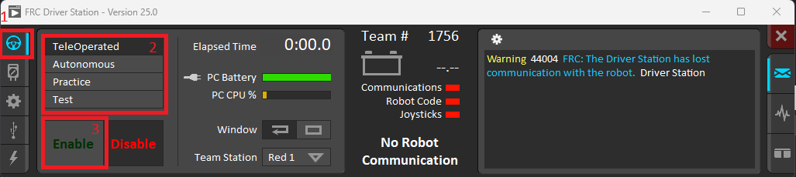
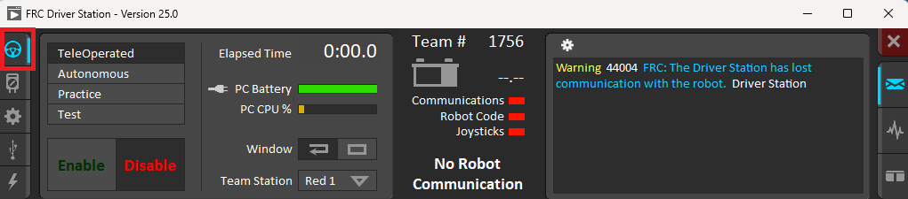

# FRC Driver Station Overview

The FRC Driver Station is the software used to control and monitor your robot. It is the primary interface between the drive team and the robot during a match. It provides critical information about the robot's status, allows you to enable and disable the robot, and select its operating mode.

This guide provides a basic overview. For a complete guide, please refer to the [official WPILib documentation](https://docs.wpilib.org/en/stable/docs/software/driverstation/driver-station.html).

---

## Opening FRC Driver Station
To open the FRC Driver Station, find the shortcut on your desktop or search for "FRC Driver Station" in the Windows Start Menu. Double-click the icon to launch the application.   

---
## Enabling the robot
Before your robot can move, it must be enabled from the Driver Station. For this to work, you must have green lights for both **Communications** and **Robot Code**.

1.  Select the Operation Tab
2.  Select the desired mode (e.g., **Teleoperated** or **Autonomous**).
3.  Click the **Enable** button. The robot is now active.

To stop the robot at any time, click the **Disable** button or press the **spacebar**. The robot will always start in a disabled state for safety.

---

## The Operation Tab

The **Operation** tab is the main screen you will use to control the robot.  

Let's break down the key sections:

### 1. Robot Status Indicators
* This row of lights gives you a quick "at-a-glance" view of the robot's connection status.
    *   **Communications:** A green light indicates that the Driver Station is successfully communicating with the robot's radio.
    *   **Robot Code:** A green light means that your robot code is running on the RoboRIO.
    *   **Joysticks:** A green light shows that at least one joystick is recognized by the Driver Station.

### 2. Robot Mode
* This section allows you to select the robot's operational mode.
    *   **Teleoperated:** Used for the driver-controlled period of a match.
    *   **Autonomous:** Used to run pre-programmed instructions without driver input.
    *   **Practice:** Runs a timed practice match sequence.
    *   **Test:** A mode used for testing individual mechanisms or sensors.

### 3. Enable/Disable Controls
* This is the most important control on the Driver Station.
    *   **Enable:** Allows the robot to move. The robot will only run code and move motors when it is enabled and in an appropriate mode (Teleoperated or Autonomous).
    *   **Disable:** Acts as a safety stop. Pressing this or hitting the spacebar will immediately stop all robot motion. The robot will always start in a disabled state.

---
## The Setup Tab

The setup tab is where you will be changing settings to set up your robot and the length of matches.

### 1. Team Number
* Before you can connect to a robot, you must set your team number here. For Argos, this is **1756**. The Driver Station will not be able to communicate with the robot if this is not set correctly. This can be found in the **setup** tab
    * 

### 2. Practice Timing (s)
* This section allows you to set the length of each period for a practice match. When you run the robot in "Practice" mode from the Operation tab, it will use these custom durations for the autonomous, delay, and teleoperated periods.

