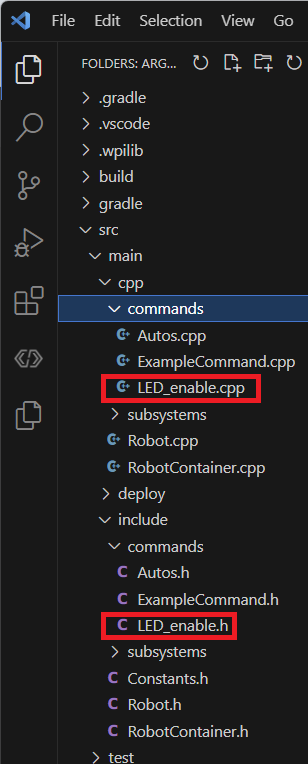

# Creating Subsystems / Commands

## Creating a Subsystem

To create a new subsystem in VS Code with the WPILib extension:  

1. Right-click on the `src/main/include/subsystems` folder in the file explorer.  

2. Select `WPILib: Create a new class/command`.  
    

3. Choose `Subsystem` from the list.  
    

4. Name the new subsystem `Drivetrain`.  
    

5. You should see two folder now in one in `src/main/include/subsystems` called `Drivetrain.h`  and the other in `src/main/cpp/subsystems` called `Drivetrain.cpp`  
  

## Creating a Command

To create a new command in VS Code with the WPILib extension:  

1. Right-click on the `src/main/include/commands` folder in the file explorer.  

2. Select `WPILib: Create a new class/command`.  
   
  
3. Choose `Subsystem` from the list.  
   

4. Name the new subsystem `LED_enable`.  
   

5. You should see two folder now in one in `src/main/include/commands` called `LED_enable.h`  and the other in `src/main/cpp/commands` called `LED_enable.cpp`   
