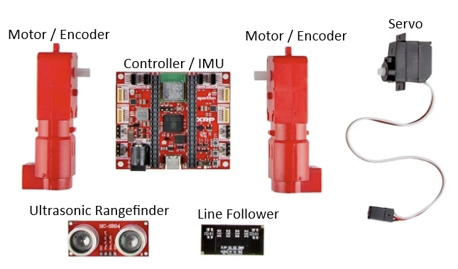

# XRP Overview

## What is the XRP Robot?
The XRP is a compact robot designed to teach the fundamentals of writing software and using sensors to accomplish tasks. A key feature of the XRP is its support for multiple programming languages, providing a versatile learning path.

We will begin with Blockly, a visual programming language where you build programs by connecting blocks, much like assembling LEGOs. This approach is excellent for learning core coding concepts, though it has its limitations.

After mastering Blockly, we will transition to C++, the same language used for our full-sized competition robot. The benefit of this is that the XRP C++ code shares the same structure as our main robot's code. This means nearly every skill you develop with the XRP is directly transferable to programming the competition robot.

Now, let's get started!

for more details on the XRP robot visit [XRP Overview](https://xrpusersguide.readthedocs.io/en/latest/course/introduction.html)

## Robot Overview

To move and interact with its environment, the XRP comes equipped with several components:

*   **Motors:** The XRP has two motors that drive the wheels, allowing it to move forward, backward, and turn.
    
*   **Encoders:** Each motor has a built-in encoder. These sensors measure how far the wheels have turned, which allows for precise control over the robot's movement and distance traveled. The encoder are built into the motors.
   
*   **6-axis IMU (Inertial Measurement Unit):** Located on the main controller board, the IMU measures the robot's linear acceleration and rotational velocity across three axes. This is useful for detecting movement, orientation, and tilt.

*   **Ultrasonic Rangefinder:** This sensor measures the distance to objects directly in front of it by sending out sound waves and measuring how long they take to return. It's great for obstacle avoidance.

*   **Line Follower:** The kit includes a line follower sensor. This sensor can detect a dark line on a light surface (or vice-versa), allowing the robot to be programmed to follow a path.

*   **Servo Outputs:** The controller board includes four outputs to control servos. Servos are small motors that allow for precise control of angular position, making them ideal for tasks like operating a gripper or a small arm.

## Assembling your XRP robot
Click the image below link for instruction on assembling your XRP robot

## XRP Tutorial overview

1. Blockly XRP
    1. This will teach you the basic of coding

2. [C++ XRP Tank Drive](../../tutorials/XRP_Tank_Drive/tutorial_XRP_tank_drive.md)

3. [C++ XRP Arcade Drive](../../tutorials/arcade-drive.md)

4. C++ XRP Button drive

5. C++ deadband

6. C++ swerve drive

## Useful links

