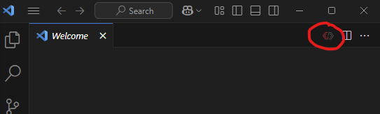

# Creating a C++ XRP Project
This tutorial details how to create a blank C++ XRP project using the command-based framework. For a more in-depth overview, please refer to the [WPILib documentation](https://docs.wpilib.org/en/stable/docs/zero-to-robot/step-2/wpilib-setup.html).

## Project Creation Steps
1. Open WPILib VS Code. If you do not have this, see the [WPILib Installation Guide](https://docs.wpilib.org/en/stable/docs/zero-to-robot/step-2/wpilib-setup.html).   

2. Click the WPILib icon.
    1. WPILib icon is in the upper-right corner.
    2.   

3. In the prompt window, type "New Project" and click "WPILib: Create a new project".
    1.  

4. A window like this will appear: 
    1.  
    
5. Click "Select a project type (Example or Template)". 

6. A prompt window will appear. Select "Template" -> "C++" -> "XRP - Command Robot".
    1.  

7. Select a folder for your project.  

8. For Project Name: Argos Tutorial. 

9. For Team number: 1756. 

10.  **⚠️ Important: Enable Desktop Support**
     1. You must click the checkbox to **Enable Desktop Support**. This is critical for running the simulator.
    2.  

11. Click "Generate Project".
    1.  

12. Click "Yes (Current Window)".
    1. This will open the project you just created.
    2.  

13. It should open a file structure that looks like this.
    1.  

> **Note:** If you do not see the folder structure, click on the folder icon on the left-hand side to open the file explorer. 

**Congratulations!**  You have created a project.
