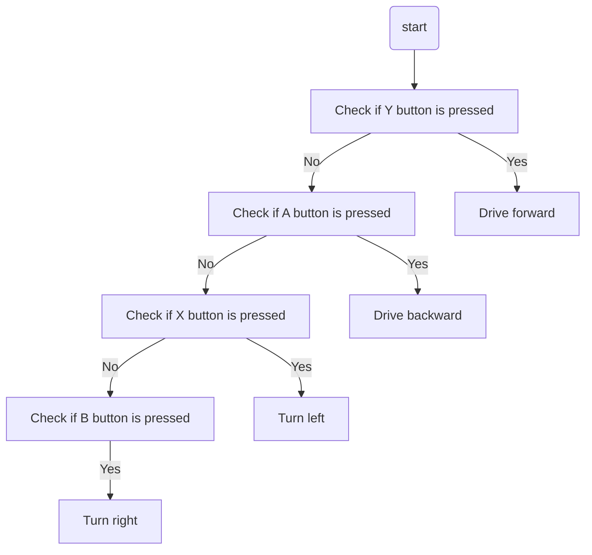

# XRP Button Drive  
## Overview
> This tutorial builds on the [XRP Tank Drive tutorial](../03_XRP_Tank_Drive/index.md). If you have not completed that one, please do so before continuing.

As you might have noticed in tank drive tutorial, driving the robot using the left and right joystick to control the power to each wheel can be difficult to control. Let's try to make something a little easier to control.

Button drive is a control scheme where specific buttons on an Xbox controller are used to control the robot's movement. For example:
- Pressing the **Y** button drives the robot forward.
- Pressing the **A** button drives the robot backward.
- Pressing the **X** button turns the robot left.
- Pressing the **B** button turns the robot right.

If you have some experience programming, try implementing this drive control now. Otherwise, read on for step-by-step instructions.

## The Pre-Code Workout 📊

Before writing any code, let's break down the tasks into a **flow chart**. This helps us visualize the steps needed to implement button-based driving.

Let's start with listing out the tasks we need to perform:
* Drive forward when the **Y** button is pressed.
* Drive backward when the **A** button is pressed.
* Turn left when the **X** button is pressed.
* Turn right when the **B** button is pressed.

### Flow Chart:
Now lets make a [Flow Chart](../../CPP_Docs/CPP_software_quick_reference/index.md#flow-charts).   Try this on your own before looking at the flow chart
<details>
<summary>Flow Chart 📊</summary>


</details>

### Inputs and Outputs
Now that we understand how the code will work we need to define the input and output of our function. It is important to also define the [data types](../../CPP_Docs/CPP_software_quick_reference/index.md#variables-and-data-types) for these inputs and outputs.

<details>
<summary>Define Inputs and Outputs.  Try defining the Inputs and Outputs before looking.</summary>

**Inputs:** 
- `forward`: Indicating if the forward button is pressed (Y): Datatype (bool).
- `backward`: Indicating if the backward button is pressed (A): Datatype (bool).
- `turnLeft`: Indicating if the turn left button is pressed (X): Datatype (bool).
- `turnRight`: Indicating if the turn right button is pressed (B): Datatype (bool).

**Outputs:**
- `Left motor power`: Left motor speed: Datatype (double).
- `Right motor power`: Right motor speed: Datatype (double).
</details> 

---


## Time to Start Coding

### Creating a project
If you haven't already created an XRP project, you'll need to do that now. See [How to Create an XRP Project](../XRP_project/tutorial_XRP_Project.md) If you have, it's time to start coding!

### Create a Drivetrain Subsystem

The first step is to create a subsystem for our drivetrain. See [How to Create a Subsystem](../../VS_Code_Docs/Create_Subsystem/creating_subsystem.md) for instructions on how to do this. You should name your subsystem `Drivetrain`.

### Drivetrain.h Header File

Just as a reminder, the header (`.h`) file is like a table of contents for our code. It declares the functions that are available, but the actual instructions for those functions are written in the source (`.cpp`) file. We are about to add a new function declaration to our `Drivetrain.h`.  

1. We need to tell the software we want to use the XRP robot motors. To do this we will need to include the header that declares the motor objects, see [Controlling a Motor](../XRP_WPILib/tutorial_XRP_WPILib.md#controlling-a-motor) for more details on controlling XRP robot motor.
    1. We will need to add the following include to the top of the `Drivetrain.h` file
    ```cpp
    #include <frc/xrp/XRPMotor.h>
    ```
2. Now we need to tell our code about the two motors on the robot. 
    1. Let's add the code to create these motor objects inside our `Drivetrain` class. We'll put them in the `private` section of `Drivetrain.h`. Making them `private` means only the `Drivetrain` code can talk to the motors directly, which helps keep our project organized.
     ```cpp
       // This creates an object for the left motor on channel 0
       frc::XRPMotor m_left_motor{0};
       // This creates an object for the right motor on channel 1
       frc::XRPMotor m_right_motor{1};
     ```

3. We will be adding in a ButtonDrive function in the public section.   
   ```cpp
    // A function to drive the robot with button drive controls.
    // It takes button press and turns them into left and right motor speeds
    void ButtonDrive(bool forward, bool backward, bool turnLeft, bool turnRight);
   ```
<details>
<summary>What does this declaration mean?</summary>

- **`void`**: This is the function's return type. `void` means this function does not return any value after it runs; it only performs actions.
- **`ButtonDrive`**: This is the name we've given our function.
- **`(bool forward, ...)`**: The parentheses contain the function's **parameters** (the inputs). Each parameter has a data type and a name.
  - `bool forward`: A parameter named `forward` that expects a `bool` (true/false) value.
  - `bool backward`: A parameter named `backward` that expects a `bool` (true/false) value.
  - `bool turnLeft`: A parameter named `turnLeft` that expects a `bool` (true/false) value.
  - `bool turnRight`: A parameter named `turnRight` that expects a `bool` (true/false) value.
</details>

<details>
<summary>Your Drivetrain.h file should look like this.</summary>

  ```cpp
  // Copyright (c) FIRST and other WPILib contributors.
  // Open Source Software; you can modify and/or share it under the terms of
  // the WPILib BSD license file in the root directory of this project.

  #pragma once

  #include <frc2/command/SubsystemBase.h>
  #include <frc/xrp/XRPMotor.h>

  class Drivetrain : public frc2::SubsystemBase {
  public:
    Drivetrain();

    // A function to drive the robot with button drive controls.
    // It takes button press and turns them into left and right motor speeds
    void ButtonDrive(bool forward, bool backward, bool turnLeft, bool turnRight);
    
    /**
     * Will be called periodically whenever the CommandScheduler runs.
     */
    void Periodic() override;

  private:
    // Components (e.g. motor controllers and sensors) should generally be
    // declared private and exposed only through public methods.

      // This creates an object for the left motor on channel 0
      frc::XRPMotor m_left_motor{0};
      // This creates an object for the right motor on channel 1
      frc::XRPMotor m_right_motor{1};
  };

  ```
</details>

### Drivetrain.cpp Source File

Now that we've declared our function in the header file, it's time to define what it actually does in the source (`.cpp`) file. The flow chart you created earlier is crucial here, as it provides a clear visual representation of the logic, making it easier to translate the planned steps into actual code.

 We will add the `ButtonDrive` function definition under `Drivetrain::Periodic()`
   ```cpp
  // This is the definition of our Button Drive function.
  // The code inside the curly braces {} is what runs when we call this function.
   void Drivetrain::ButtonDrive(bool forward, bool backward, bool turnLeft, bool turnRight) 
   {

   }
   ```
  Next, we will add the code to the `ButtonDrive` function. This function will use an `if-else if-else` statement to determine the robot's movement based on the button inputs. If you're unfamiliar with `if-else` statements, refer to the [if-else statements guide](../../CPP_Docs/CPP_software_quick_reference/index.md#if-else-statements) for more details.  We will be writing our code in between the `{}` in `Drivetrain::ButtonDrive`

  Here is the implementation:

  ```cpp
  // Check if the forward button is pressed
  if (forward) {
    m_left_motor.Set(1);  // Drive forward
    m_right_motor.Set(-1); // Drive forward (inverted)
  }
  // Check if the backward button is pressed
  else if (backward) {
    m_left_motor.Set(-1);  // Drive backward
    m_right_motor.Set(1);  // Drive backward (inverted)
  }
  // Check if the turnLeft button is pressed
  else if (turnLeft) {
    m_left_motor.Set(-1);  // Turn left
    m_right_motor.Set(-1); // Turn left
  }
  // Check if the turnRight button is pressed
  else if (turnRight) {
    m_left_motor.Set(1);   // Turn right
    m_right_motor.Set(1);  // Turn right
  }
  // If no buttons are pressed, stop the robot
  else {
    m_left_motor.Set(0.0);   // Stop
    m_right_motor.Set(0.0);  // Stop
  }
  ```
<details>
<summary>Your Drivetrain.cpp file should look like this.</summary>

  ```cpp
    // Copyright (c) FIRST and other WPILib contributors.
    // Open Source Software; you can modify and/or share it under the terms of
    // the WPILib BSD license file in the root directory of this project.

    #include "subsystems/Drivetrain.h"

    Drivetrain::Drivetrain() = default;

    // This method will be called once per scheduler run
    void Drivetrain::Periodic() {}

    // This is the definition of our Button Drive function.
    // The code inside the curly braces {} is what runs when we call this function.
    void Drivetrain::ButtonDrive(bool forward, bool backward, bool turnLeft, bool turnRight) 
    {
    // Check if the forward button is pressed
    if (forward) {
      m_left_motor.Set(1);  // Drive forward
      m_right_motor.Set(-1); // Drive forward (inverted)
    }
    // Check if the backward button is pressed
    else if (backward) {
      m_left_motor.Set(-1);  // Drive backward
      m_right_motor.Set(1);  // Drive backward (inverted)
    }
    // Check if the turnLeft button is pressed
    else if (turnLeft) {
      m_left_motor.Set(-1);  // Turn left
      m_right_motor.Set(-1); // Turn left
    }
    // Check if the turnRight button is pressed
    else if (turnRight) {
      m_left_motor.Set(1);   // Turn right
      m_right_motor.Set(1);  // Turn right
    }
    // If no buttons are pressed, stop the robot
    else {
      m_left_motor.Set(0.0);   // Stop
      m_right_motor.Set(0.0);  // Stop
    }
    }
  ```
</details>

### RobotContainer.h  header File
We will now need to open `RobotContainer.h`  
1.  First, we need to tell our `RobotContainer` (the brain) where to find the blueprints for our `Drivetrain`, our `XboxController`, and the `RunCommand` we'll use to connect them. We do this by including their header files at the top of `RobotContainer.h`. Including a header is like giving the brain the instruction manual for a specific part or tool before it can use it.

     ```cpp
     #include "subsystems/Drivetrain.h"
     #include <frc/XboxController.h>
     #include <frc2/command/RunCommand.h>
     ```
2.  Next, we need to create the actual `Drivetrain` and `XboxController` objects inside our `RobotContainer`. Think of this as giving the brain its own set of legs and ears to use. We'll declare these in the `private` section to keep our code organized. For more details on the controller, see the [Xbox Controller section in the WPILib tutorial](../XRP_WPILib/tutorial_XRP_WPILib.md#xbox-controller).

     ```cpp
     private:
       // Create an instance of our Drivetrain subsystem
       Drivetrain m_drivetrain;

       // Create an instance of the Xbox Controller on USB port 0
       frc::XboxController m_controller{0};
     ```

<details>
<summary>Your Drivetrain.h file should look like this.</summary>

```cpp
  // Copyright (c) FIRST and other WPILib contributors.
  // Open Source Software; you can modify and/or share it under the terms of
  // the WPILib BSD license file in the root directory of this project.

  #pragma once

  #include <frc2/command/CommandPtr.h>
  #include <frc2/command/button/CommandXboxController.h>

  #include "Constants.h"
  #include "subsystems/ExampleSubsystem.h"

  #include "subsystems/Drivetrain.h"
  #include <frc/XboxController.h>
  #include <frc2/command/RunCommand.h>

  /**
   * This class is where the bulk of the robot should be declared.  Since
   * Command-based is a "declarative" paradigm, very little robot logic should
   * actually be handled in the {@link Robot} periodic methods (other than the
   * scheduler calls).  Instead, the structure of the robot (including subsystems,
   * commands, and trigger mappings) should be declared here.
   */
  class RobotContainer {
  public:
    RobotContainer();

    frc2::CommandPtr GetAutonomousCommand();

  private:
    // Replace with CommandPS4Controller or CommandJoystick if needed
    frc2::CommandXboxController m_driverController{
        OperatorConstants::kDriverControllerPort};

    // The robot's subsystems are defined here...
    ExampleSubsystem m_subsystem;

    // Create an instance of our Drivetrain subsystem
    Drivetrain m_drivetrain;

    // Create an instance of the Xbox Controller on USB port 0
    frc::XboxController m_controller{0};

    void ConfigureBindings();
  };

```
</details>

### RobotContainer.cpp source File

The `RobotContainer.cpp`  is the file that brings the plan from the header file to life, creating the real connection between the driver's commands and the robot's movement.
1.  **Setting the Drivetrain's Default Job**

     We need to tell the `Drivetrain` what it should be doing by default: listening to our buttons. We do this by setting its "Default Command". This command will run automatically whenever no other special commands are using the drivetrain.

     In `RobotContainer.cpp`, find the `ConfigureBindings` function. This is where we'll add the code to link the controller to our `ButtonDrive` function.

     ```cpp
         // Set the default command for the drivetrain.
        // This will run whenever no other command is running on the drivetrain.  
       m_drivetrain.SetDefaultCommand(frc2::RunCommand(
           [this] {
             // Define the buttons
              bool forward = m_controller.GetYButton();
              bool backward = m_controller.GetAButton();
              bool left = m_controller.GetXButton();
              bool right = m_controller.GetBButton();
             // Drive with tank style
              m_drivetrain.ButtonDrive(forward, backward, left, right);
           },
           {&m_drivetrain}));

     ```

<details>
<summary>Your Drivetrain.cpp file should look like this.</summary>     

```cpp
  // Copyright (c) FIRST and other WPILib contributors.
// Open Source Software; you can modify and/or share it under the terms of
// the WPILib BSD license file in the root directory of this project.

#include "RobotContainer.h"

#include <frc2/command/button/Trigger.h>

#include "commands/Autos.h"
#include "commands/ExampleCommand.h"

RobotContainer::RobotContainer() {
  // Initialize all of your commands and subsystems here

  // Configure the button bindings
  ConfigureBindings();
}

void RobotContainer::ConfigureBindings() {

  // Set the default command for the drivetrain.
  // This will run whenever no other command is running on the drivetrain.  
 m_drivetrain.SetDefaultCommand(frc2::RunCommand(
           [this] {
             // Define the buttons
              bool forward = m_controller.GetYButton();
              bool backward = m_controller.GetAButton();
              bool left = m_controller.GetXButton();
              bool right = m_controller.GetBButton();
             // Drive with tank style
              m_drivetrain.ButtonDrive(forward, backward, left, right);
           },
           {&m_drivetrain}));


  // Configure your trigger bindings here

  // Schedule `ExampleCommand` when `exampleCondition` changes to `true`
  frc2::Trigger([this] {
    return m_subsystem.ExampleCondition();
  }).OnTrue(ExampleCommand(&m_subsystem).ToPtr());

  // Schedule `ExampleMethodCommand` when the Xbox controller's B button is
  // pressed, cancelling on release.
  m_driverController.B().WhileTrue(m_subsystem.ExampleMethodCommand());
}

frc2::CommandPtr RobotContainer::GetAutonomousCommand() {
  // An example command will be run in autonomous
  return autos::ExampleAuto(&m_subsystem);
}

```

</details>


## Time to test your code
Great job writing your first XRP code.  it is time to test your code.  Go to [XRP Run Code](../XRP_Run_Code/tutorial_XRP_run_code.md) to test your code

If everything is working correctly, you can now drive your XRP robot using the buttons

---

## Next Steps

You've built a working button drive, but you might notice the robot moves or turns too quickly. The speeds are hardcoded as `1` and `-1`, which makes them hard to adjust. 
In the next tutorial, we'll learn how to "tune" these values by replacing them with named variables, making our code much cleaner and easier to adjust.

➡️ **Continue to [Tuning with Variables and Namespaces](../05_Tuning/index.md)**
