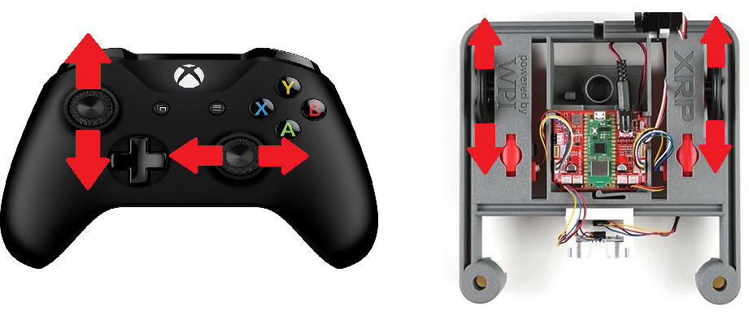
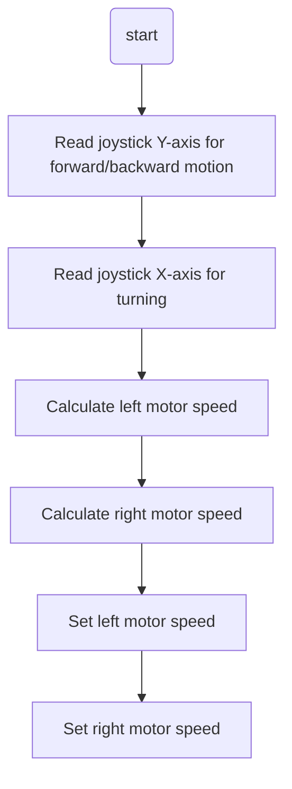

# XRP Arcade Drive  
## Overview
You saw that tank drive gave you a ton of control, but it was really hard to drive smoothly. Then, button drive was super easy to use, but you lost a lot of that fine-tuned control. Now, let's try arcade drive to find a good mix!

Arcade drive may be more familiar, because it is the basis of many video games. One joystick moves the robot forward and backward, and the second joystick turns left and right To do this, we will make the left joystick set a value for both motors and the right joystick will increase or decrease the motor speeds to turn the robot This control scheme offers less driver control, but it’s easy to learn and many drivers enjoy it  



If you have already implemented the Tank Drive tutorial, you can build on that project to add Arcade Drive functionality. No need to create a new project!

## The Pre-Code Workout 📊

Before writing any code, let's plan our `ArcadeDrive` function. This function will translate joystick inputs into motor speeds, combining forward/backward motion and turning into a single control scheme.

### Inputs and Outputs

The function needs two inputs from the joystick and will produce two outputs to control the motors.

*   **Inputs**:
    1.  **`forward` (double)**: Controls forward/backward motion (from the joystick's Y-axis).
    2.  **`turn` (double)**: Controls turning motion (from the joystick's X-axis).

*   **Outputs**:
    *   **Left Motor Speed**: Calculated as `forward + turn`.
    *   **Right Motor Speed**: Calculated as `forward - turn` (inverted).

### Tasks:
1. Read joystick Y-axis for forward/backward motion.
2. Read joystick X-axis for turning.
3. Calculate left and right motor speeds based on the inputs.
4. Set the motor speeds to control the robot.

### Flow Chart:
<details>
<summary>Flow Chart 📊</summary>


</details>

## Time to Start Coding

If you haven't already completed the Tank Drive tutorial, see [Tank Drive Tutorial](../03_XRP_Tank_Drive/index.md). If you have, let's add Arcade Drive functionality to the same project.

### Drivetrain.h Header File

1. Add the `ArcadeDrive` function declaration to the `Drivetrain` class:
   ```cpp
   public:
     void ArcadeDrive(double forward, double turn);
   ```

### Drivetrain.cpp Source File

1. Define the `ArcadeDrive` function:
   ```cpp
   void Drivetrain::ArcadeDrive(double forward, double turn) {
     // Calculate the speed for each motor
     double leftSpeed = forward + turn;
     double rightSpeed = forward - turn;

     // Set the motor speeds
     m_left_motor.Set(leftSpeed);
     m_right_motor.Set(-rightSpeed); // Invert right motor
   }
   ```

   **Explanation:**
   - The `forward` value controls the robot's forward and backward motion.
   - The `turn` value adjusts the difference between the left and right motor speeds to make the robot turn.
   - The right motor is inverted to ensure the robot drives straight when both motors are set to the same speed.

### RobotContainer.cpp Source File

1. Update the `ConfigureBindings` function to use `ArcadeDrive` as the default command. You will need to comment out or delete the existing `TankDrive` default command.
   ```cpp
   void RobotContainer::ConfigureBindings() {
     // To switch to Arcade Drive, we need to disable the Tank Drive code.
     // You can do this by commenting it out with "//" at the beginning of each line.
     // m_drivetrain.SetDefaultCommand(frc2::RunCommand(
     //     [this] {
     //       m_drivetrain.TankDrive(
     //           -m_controller.GetLeftY(),
     //           -m_controller.GetRightY());
     //     },
     //     {&m_drivetrain}));

     // Set the default command for the drivetrain to Arcade Drive
     m_drivetrain.SetDefaultCommand(frc2::RunCommand(
         [this] {
           m_drivetrain.ArcadeDrive(
               -m_controller.GetLeftY(), // Forward/backward
               m_controller.GetLeftX()); // Turning
         },
         {&m_drivetrain}));
   }
   ```

   **Explanation:**
   - `GetLeftY()` reads the Y-axis of the left joystick for forward/backward motion.
   - `GetLeftX()` reads the X-axis of the left joystick for turning.
   - The minus sign (`-`) inverts the Y-axis because pushing the joystick forward gives a negative value.

## Time to Test Your Code

Congratulations! You've added Arcade Drive functionality to your Tank Drive project. Test your code by following the instructions in [XRP Run Code](<../../WPILib_VS CodeDocs/04_Simulate Robot Code/index.md>).